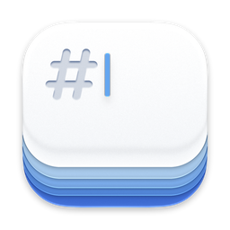
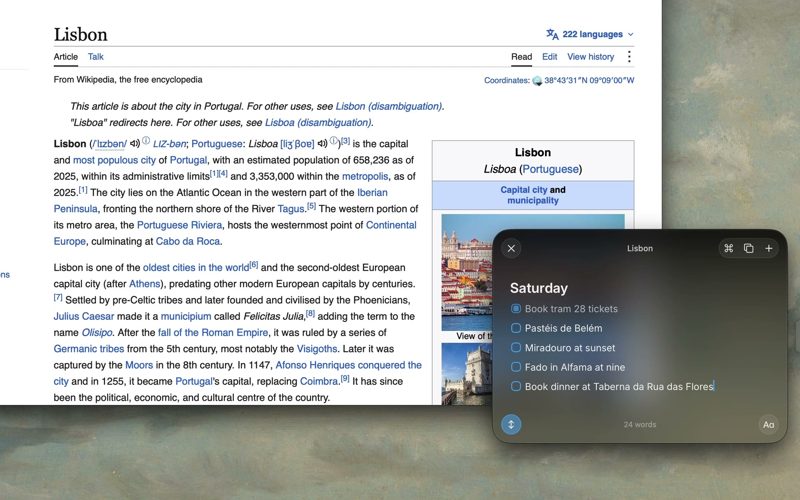

<p align="center">
  
</p>

<h1 align="center">Cirrus</h1>

<p align="center">Notes that float, for macOS.</p>

<p align="center">
  <a href="https://trycirrus.app/download"><b>Download</b></a>
  &nbsp;·&nbsp;
  <a href="https://trycirrus.app">Website</a>
  &nbsp;·&nbsp;
  <a href="https://trycirrus.app/changelog">Changelog</a>
</p>

<p align="center">
  
</p>

Press `⌃⌘N` from any app and a note appears over whatever you're doing. Write, press Escape, and it's gone.

- **Markdown** with checklists, highlights, and a `⌘K` command palette
- **Math inline**: end a line with `=` to see the result, with units, dates, and currencies
- **Edge pill and notch** to peek at notes without switching apps
- **iCloud sync** through your own account, across every Mac you own
- **Clipboard capture**, Shortcuts, and Siri
- **Export** every note as plain `.md` files, any time

## Install

[Download the DMG](https://trycirrus.app/download), or use Homebrew:

```sh
brew install --cask mshll/tap/cirrus
```

Requires macOS 26 or later. Updates install from inside the app.

## Feedback

- [Report a bug](https://github.com/mshll/cirrus/issues/new?template=bug.yml). Reporting from Settings > About fills in your version.
- [Request a feature](https://github.com/mshll/cirrus/issues/new?template=feature.yml)
- [Ask a question or share an idea](https://github.com/mshll/cirrus/discussions)

Issues are public. For anything private, email [contact@trycirrus.app](mailto:contact@trycirrus.app).

## This repo

Cirrus is closed source. This repo hosts the [releases](https://github.com/mshll/cirrus/releases), their [release notes](notes/), the update feed, and feedback.
